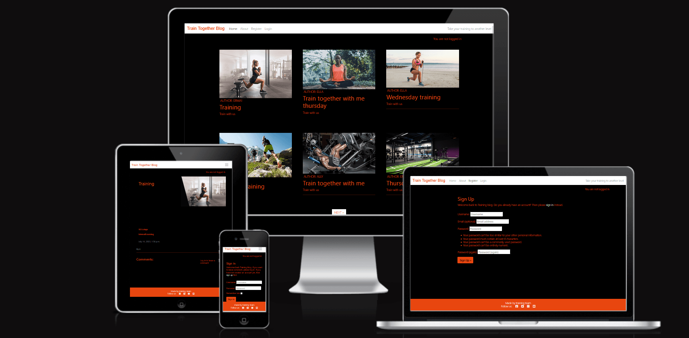
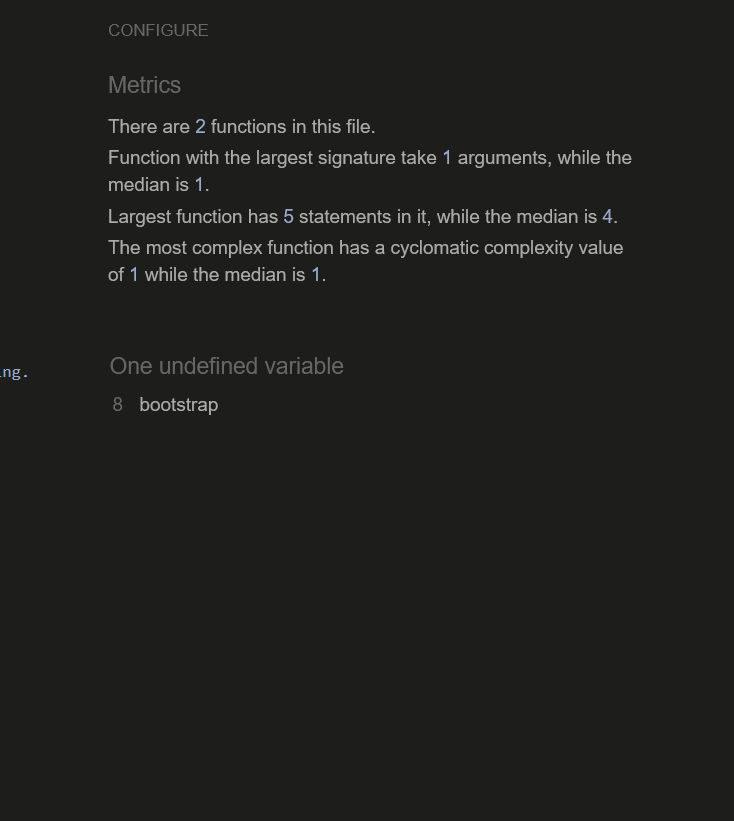
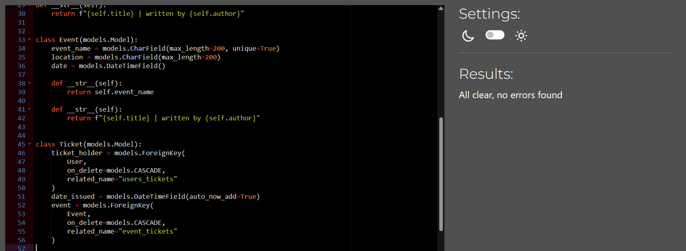
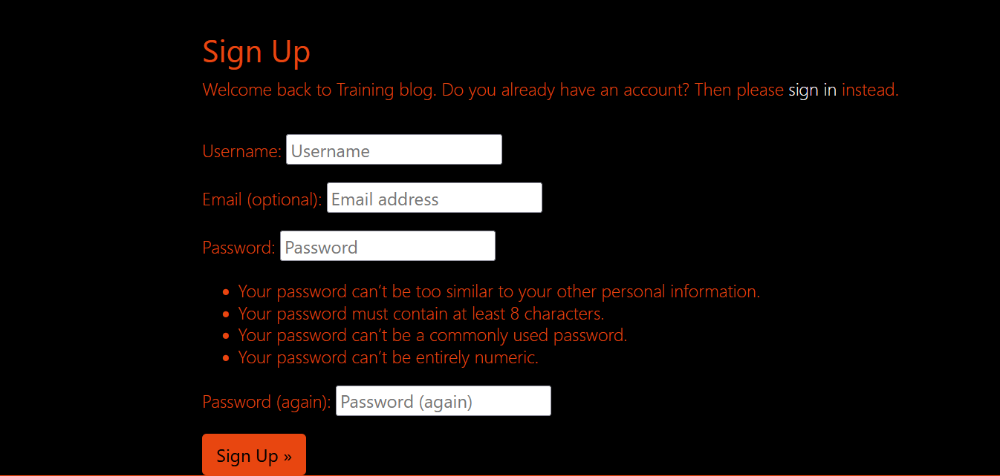
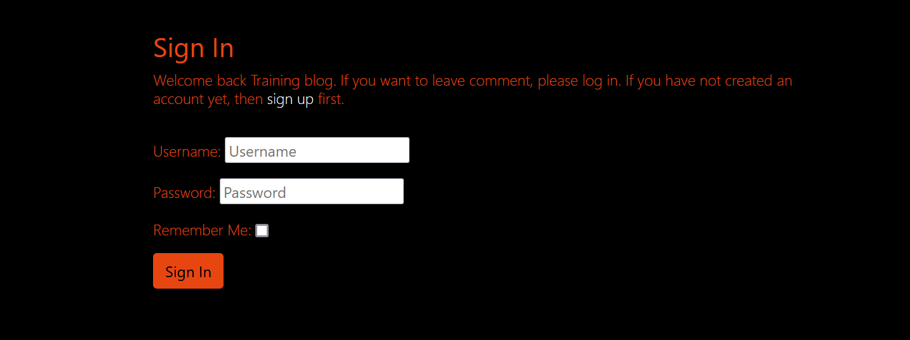

# Train Together Blog

Train together blog is blog where you as a user can find good inspiration for your training lifestyle. The app is targeted towards users who enjoy training insid the gym, as well as outside in nature. This blog is perfect for users that want save time with planing their training sessions.

This site acts as a repository for training sessions where user can store their own sessions as well as other users sessions.

The live link can be found here -[Train Together Blog](https://train-together-4d4fa50e508e.herokuapp.com/)

# Table of Contents
- [Train Together Blog](#train-together-blog)
- [User Experience (UX)](#user-experience-ux)
- [User Stories](#user-stories)
    + [EPIC Post List](#design)
    + [EPIC About](#about)
    + [EPIC Sign In](#sign-in)
    + [EPIC Comment](#comment)
    + [EPIC Editing comments](#edditing-comments)
    + [EPIC Adding pictures](#adding-pictures)
- [Design and colour scheme](#design-and-colour-scheme)
- [Imagery](#imagery)
- [Wireframes](#wireframes)
- [ Agile Methodology](#agile-Methodology)
- [Testing](#testing)
- [Features](#features)
    + [Navigation Bar](#navigation-bar)
    + [Footer](#footer)
    + [Home Page](#home-page)
    + [About](#about)
- [User account pages](#user-account-pages)
    + [Sign Up](#sign-up)
    + [Log In](#log-in)
    + [Log Out](#log-out)
- [Deployment - Heroku](#deployment-heroku)
    + [Create the Heroku App](#create-the-heroku-app)
    + [Attach the Postgres database](#attach-the-postgres-database)
    + [Prepare the environment and settings.py file](#prepare-the-environment-and-settings.py-file)
    + [Create files/directories](#create-files/directories)
    + [Update Heroku Config Vars](#uppdate-heroku-config-vars)
    + [Deploy](#deploy)
- [Languages](#languages)
- [Frameworks - Libraries - Programs Used](#frameworks-libraries-programs-used)
- [Acknowledgments](#acknowledgments)

## User Experience (UX)
A visitor to Train Together Blog would be someone who is most likely an adult who enjoy training inside and outside  and someone who want to save a time and effort planing too much infront of every training session.
### User Stories
#### EPIC | Post List
1. As a user i want to se list of posts.
2. Give a site more than one post at the time and a list is seen when a user opens a site.
#### EPIC | About
1. As a site user I want to read about this blog.
#### EPIC | Sign In 
1. As a site user i want to be able to sing in to this blog.
2. As a returning user i want to be able to log in to this blog.
#### EPIC | Comment
1. As a user i want to be able to leave comment on a post.
#### EPIC | Edditing comments
1. Loged-in user can modify comments
2. Logged-in user can delete their comments
#### EPIC | Adding pictures
As a user I want to have picture about specific post in a blog.

### Design and colours scheme
The website has mix of dark, white and red colours. Those colours and dsign of the website were chosen in order to keep in theme with the site goals and to increase motivations level.

#### Imagery
All of the images at the website are designed by different authors to make sure that users have a choice between a gym training and outside in nature training.

#### Wireframes

 
Landing Page

 

 ## Agile Methodology
 GitHub projects was used to manage development process using agile approach. GitHub issues were created for every User Story and every User Story has defined acceptance criteria to make sure UserStory has been compleated.

## Testing
Testing and results can be found here:

- CSS

- HTML

- Terminal testing

- Every python file was manually tested with no errors found.

### User Authentication
- Django's LoginRequiredMixin is used to make sure that users that are non-authenticated do not have acces to secure pages.

## Features
**Navigation Bar**
- The navigation bar is present at the top of every page and includes links, as well as name of the site and a slogan.
- When a user is logged in, menu changed to , Home, About, Logout. 
/navbar.png)

### Footer
- The footer section includes links to Facebook, Instagram, Twitter and Youtube.
/Footer.png)

### Home Page
- Home page includes every post for this website. There is variation between gym training and outside in nature training so that every user can find something for themselves. In this section there is possibility to leave, uppdate and edit a comment as well as a delete a comment.
/Homepage.png)

**About**
- About section includes information about this blog.
/About.png)

### User Account Pages
**Sign Up**

**Sign In**

**Sign Out**

## Deployment - Heroku
- To deploy this page to Heroku from its GitHub repository, the following steps were taken:

### Create the Heroku App:
- Log in to Heroku and create account.
- On the main page click the button labelled New in the top right corner and from the drop-down menu select "Create New App".
- Enter a unique and meaningful app name.
- Select your region and click create app.

### Attach the Postgres database:
- In the Resources tab, under add-ons, type in Postgres and select the Heroku Postgres option.
- Copy the DATABASE_URL located in Config Vars in the Settings Tab.

### Prepare the environment and settings.py file:
- In your GitPod workspace, create env.py file.
- Add the DATABASE_URL value and  SECRET_KEY t env.py file.
- Update the settings.py file to import the env.py file and add the SECRETKEY and DATABASE_URL file paths.
- Comment out  the default database configuration.
- Save file than make migrations as usual.
- Add Cloudinary URL to env.py.
- Add the cloudinary libraries to the list of installed apps.
Add the STATIC files settings - the url, storage path, directory path, root path, media url and default file storage path.
- Link the file to the templates directory in Heroku.
- Change the templates directory to TEMPLATES_DIR
- Add Heroku to the ALLOWED_HOSTS list the format ['app_name.heroku.com', 'localhost']

### Create files / directories
- Create requirements.txt file.
- - Create three directories in the main directory; media, storage and templates.
- Create a file named "Procfile" in the main directory and add the following: web: gunicorn project-name.wsgi

### Update Heroku Config Vars
Add theese Config Vars in Heroku.
- SECRET_KEY value (choose value)
- CLOUDINARY_URL
- PORT = 8000
- DISABLE_COLLECTSTATIC = 1

### Deploy
- For every deployment DEBUG= False in settings.py.
- On deploy tab on Heroku connect your project to Heroku.
- Scroll down and deploy page manually.
- Click view.

## Languages
- Python
- HTML
- CSS
- Javascript

## Frameworks - Libraries - Programs Used
- [Django](https://www.djangoproject.com/)
- [PostgreSQL](https://www.postgresql.org/)
- [Heroku](https://dashboard.heroku.com/apps)
- [Balsamiq](https://balsamiq.com/)
- [GitHub](https://github.com/)
- [Google-fonts](https://fonts.google.com/)
- [W3C](https://jigsaw.w3.org/css-validator/)
- [PEP8](https://pep8ci.herokuapp.com/)
- [Favicon](https://favicon.io/)
- [Cloudinary](https://cloudinary.com/)
- [Bootstrap-4.6](https://getbootstrap.com/docs/4.6/getting-started/introduction/)
- [I-am-responsive](https://ui.dev/amiresponsive)
- [Tinypng](https://tinypng.com/)

## Acknowledgments
Thanks to my mentor Antonio for his support and advice. Thanks to 
The Code Institute slack community for their quick responses and very helpful feedback.

